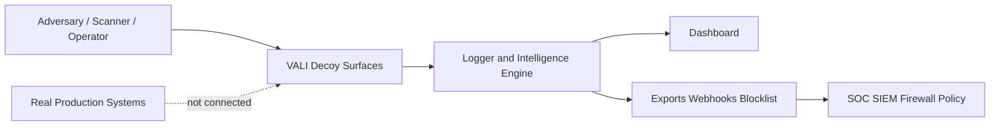
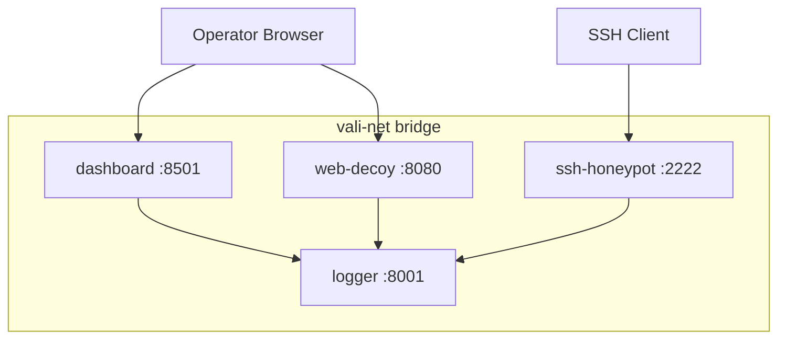
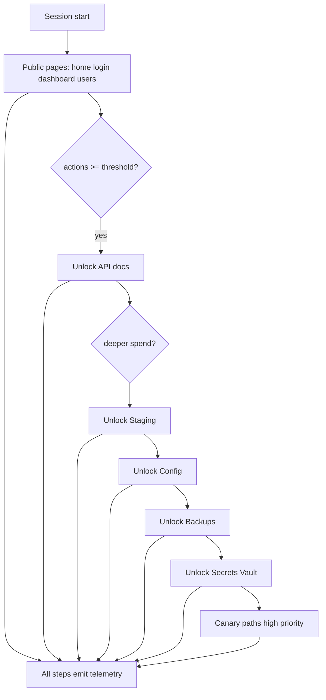
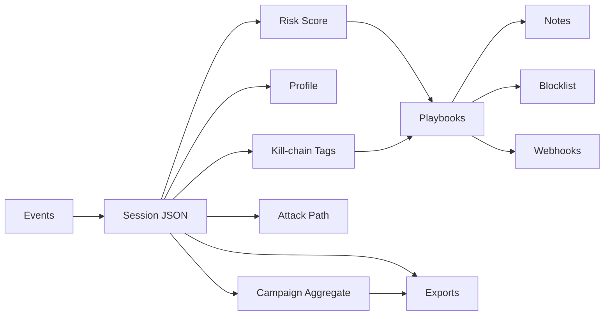
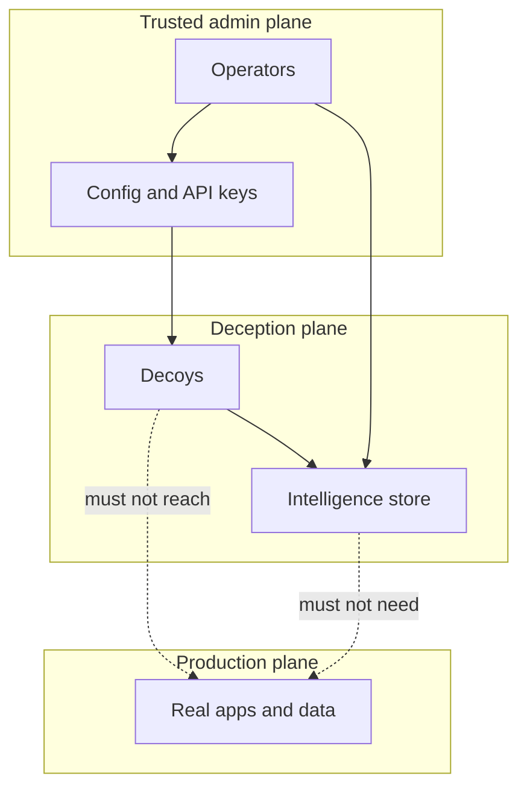

# Architecture Diagrams

## 1. Context diagram

```mermaid
flowchart LR
  A[Adversary / Scanner / Operator] --> B[VALI Decoy Surfaces]
  B --> C[Logger and Intelligence Engine]
  C --> D[Dashboard]
  C --> E[Exports Webhooks Blocklist]
  E --> F[SOC SIEM Firewall Policy]
  G[Real Production Systems] -.->|not connected| B
```

## 2. Container view (reference)

```mermaid
flowchart TB
  subgraph VALI_NET[vali-net bridge]
    W[web-decoy :8080]
    S[ssh-honeypot :2222]
    L[logger :8001]
    D[dashboard :8501]
    W --> L
    S --> L
    D --> L
  end
  U[Operator Browser] --> D
  U --> W
  H[SSH Client] --> S
```

## 3. Progressive unlock flow

```mermaid
flowchart TD
  A[Session start] --> B[Public pages: home login dashboard users]
  B --> C{actions >= threshold?}
  C -->|yes| D[Unlock API docs]
  D --> E{deeper spend?}
  E --> F[Unlock Staging]
  F --> G[Unlock Config]
  G --> H[Unlock Backups]
  H --> I[Unlock Secrets Vault]
  I --> J[Canary paths high priority]
  B --> K[All steps emit telemetry]
  D --> K
  F --> K
  G --> K
  H --> K
  I --> K
  J --> K
```

## 4. Intelligence pipeline

```mermaid
flowchart LR
  E[Events] --> S[Session JSON]
  S --> R[Risk Score]
  S --> P[Profile]
  S --> K[Kill-chain Tags]
  S --> AP[Attack Path]
  S --> C[Campaign Aggregate]
  R --> PB[Playbooks]
  K --> PB
  PB --> N[Notes]
  PB --> B[Blocklist]
  PB --> W[Webhooks]
  S --> X[Exports]
  C --> X
```

## 5. Safety boundary

```mermaid
flowchart TB
  subgraph TRUSTED[Trusted admin plane]
    CFG[Config and API keys]
    OPS[Operators]
  end
  subgraph DECEPTION[Deception plane]
    DEC[Decoys]
    INT[Intelligence store]
  end
  subgraph PROD[Production plane]
    APP[Real apps and data]
  end
  OPS --> CFG
  CFG --> DEC
  DEC --> INT
  OPS --> INT
  DEC -.->|must not reach| APP
  INT -.->|must not need| APP
```
