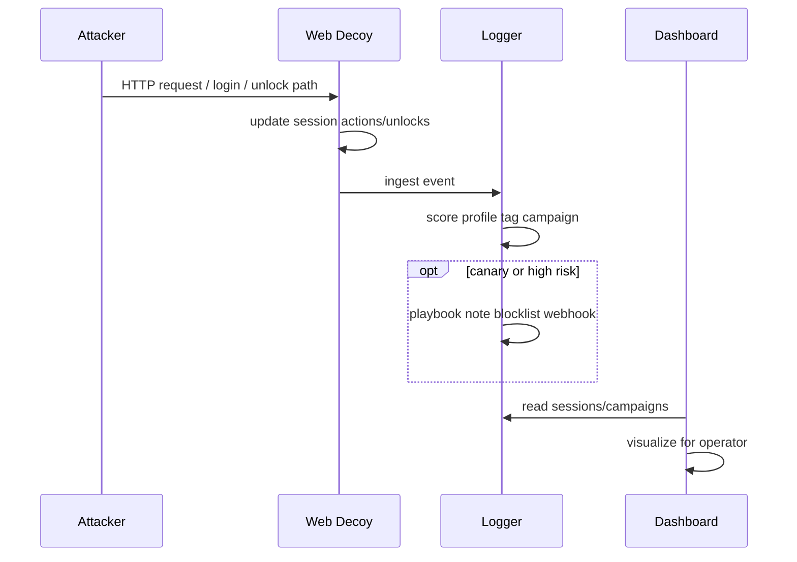
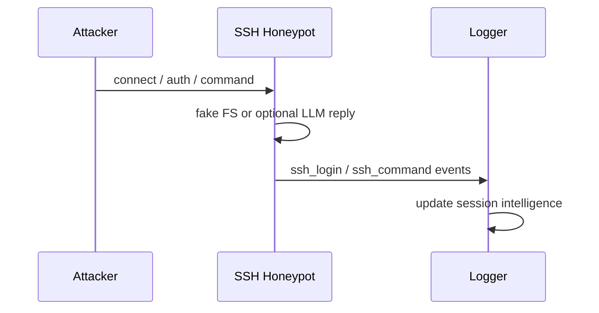

# Operational and Adversary Flows

## 1. Attacker engagement story (nominal)

```text
1. Attacker discovers portal (scan, link, spray)
2. Views overview — believes internal admin surface
3. Attempts login — credential_access events
4. Explores operations / identity pages
5. Progressive unlocks reveal API, staging, config
6. Pursues backups / vault — canaries may fire
7. Parallel SSH probe may occur from same IP
8. Defender sees session risk, profile, path, campaign narrative
```

## 2. Defender workflow

```text
1. Deploy VALI fabric in isolated network segment
2. Point monitoring at dashboard + webhooks
3. On canary / high risk: triage session timeline
4. Export indicators if needed
5. Apply downstream controls using blocklist/export
6. Rotate decoy state periodically
```

## 3. Sequence: web request to intelligence



## 4. Sequence: SSH command


